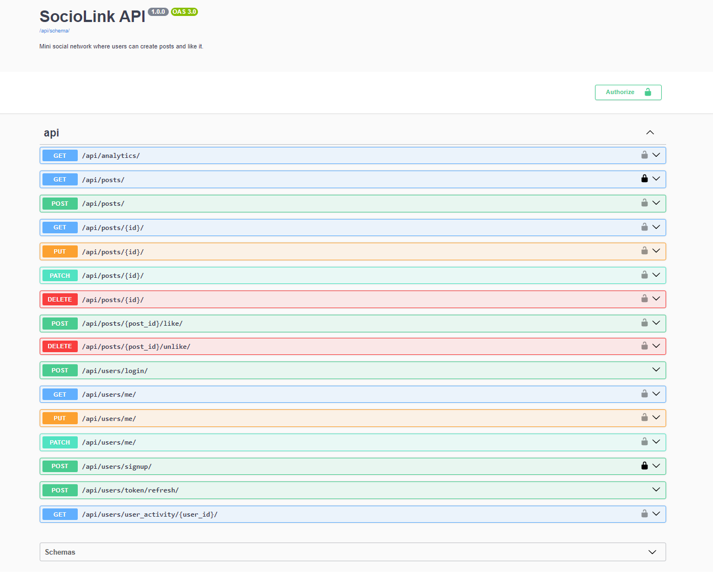

# SocioLink API 
___
#### I've developed this REST API for a mini social network named "SocioLink", using Python and Django Rest Framework. It supports user registration, login, post creation, and post likes/unlikes, along with daily like analytics and user activity tracking. PostgreSQL is employed for effective and reliable database. Additionally, an automated bot is included to simulate user activities. Feel free to explore!

## 🔧 Technologies used:
___
* [X] Django Rest Framework
* [X] Django ORM
* [X] PostgreSQL
* [X] Docker

# 🧾 Features
___
* [X] JWT authentication 🔒
* [X] Detailed Documentation of all endpoints on "http://127.0.0.1:8000/api/doc/swagger/"
* [X] Totally Dockerized
* [X] Different permissions for different actions (allows user sign-ups, logins, post creations, and liking/unliking of posts. It also provides daily analytics on likes and user activity insights, such as the last login and request made.)


### 💾 Installation:
___
#### 1. Clone the repository:
```shell
git clone https://github.com/bohdan-yatsyna/SocioLink
cd SocioLink
```
#### 2. Create and activate virtual environment with requirements install:
🖥 Windows:
```shell
python -m venv venv
venv\Scripts\activate
```
💻 Linux/MacOS:
```shell
python -m venv venv
source venv/bin/activate
```
#### 3. 🗝 Set up environment variables (using .env):
- Create an empty .env file in the root folder of the project.
- Copy the entire content of the .env.sample to your .env file.
- Modify the placeholders in the .env file with your preferable environment variables.

#### 4. 🐳 Run it with DOCKER:
- DOCKER should be installed and opened.
```shell
docker-compose up --build
```
- And open in your browser "http://127.0.0.1:8000/"

####  !!! Note, test data will be automatically loaded to the database !!!
### Feel free to use next admin user credentials to test my app:
```shell
email: admin@admin.com
password: TestOne1.
```

#### 🗝 For creating own admin user:  
- Check actual container id of the application with ```docker ps```  
- Enter it to the next command and run ```docker exec -it <container_id> python manage.py createsuperuser```  

#### 🗝 For creating standard user next endpoints will help:  
- **User creating** - send a POST request to /api/persons/register/ 
- **Obtain token** - send a POST request to /api/persons/login/

#### 🗝 For Authorization:
- Install **ModHeader** extension and create Request header "Authorize" with value: Bearer &lt;Your access token&gt;


# 🕶 DEMO
### Documentation with all endpoints:

